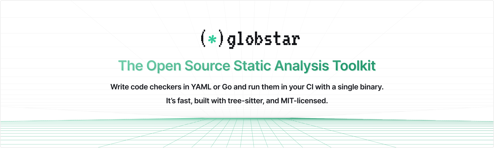

<p align="center">
  <picture>
    <source media="(prefers-color-scheme: dark)" srcset="./docs/public/img/globstar-promo-dark.png">
    
  </picture>
</p>

**Globstar** is an open-source static analysis toolkit that enables developers and security engineers to write code analysis checkers and run them using a single, portable binary. Built with performance in mind, Globstar leverages [tree-sitter](https://tree-sitter.github.io/tree-sitter/) for powerful AST-based analysis while providing a simple, intuitive interface for writing checkers using the tree-sitter query language. You can start with the YAML interface for somple checkers, and graduate to the Go interface for sophisticated ones, which provides access to the tree-sitter AST, import and scope resolutionm, and complex logic.

Write all your checker checkers in the `.globstar` directory for your repository and use the `globstar check` command to run them all across your codebase. It's that simple!

## Key features

* **Lightning-fast**: Written in Go, Globstar is designed to be fast and efficient, making it suitable for large codebases. It's distributed as a single binary, so you don't need to worry about dependencies.

* **Natively uses tree-sitter**: Write checkers using tree-sitter's [S-expressions](https://tree-sitter.github.io/tree-sitter/using-parsers/queries/1-syntax.html) instead of learning a custom DSL. For more sophisticated checkers, you can write them in Go using tree-sitter's Go bindings — with multi-file support, import and scope resolution, and more.

* **CI-friendly**: Run Globstar in any CI/CD pipeline by downloading the binary. There are no dependencies to install. It'll automatically detect the `.globstar` directory and run all the checkers.

* **Truly open-source**: The Globstar CLI and all its built-in checkers are distributed under the MIT license, so you can use it in your commercial projects without any restrictions. We're committed to ensuring that the project remains available long-term and actively involves the community in its development. No license gotchas!

## Getting Started

### Installation

```bash
curl -sSL https://get.globstar.dev | sh
```

This will download the latest version of Globstar to `./bin/globstar` in your current directory. You can also specify a different installation directory by setting the `BINDIR` environment variable.

```bash
curl -sSL https://get.globstar.dev | BINDIR=$HOME/.local/bin sh
```

#### Installing it globally

If you'd like to install Globstar globally, you can move the binary to a directory in your `PATH`.

```bash
mv ./bin/globstar /usr/local/bin
```

Once installed, you can run `globstar check` in any repository to run all the checkers in the builtin checkers that come with Globstar along with all checkers defined in the repository's `.globstar` directory.

### Writing a checker

Create a new folder named `.globstar` in your repository's root. This is where you'll write all your custom checkers. Each checker is defined in a separate YAML file, with the filename being the checker's identifier and tree-sitter's S-expression query defining the pattern to match.

For example, here's a checker that detects potentially dangerous use of the `eval()` function in Python:

```yml
# .globstar/dangerous_eval.yml

language: python
name: dangerous_eval
message: "Dangerous use of eval() detected. Use ast.literal_eval() or proper serialization instead."
category: security
severity: critical

pattern: >
    (call
      function: (identifier) @func
      (#eq? @func "eval")
      arguments: (argument_list
        [
          (identifier)
          (binary_operator)
        ]
      )
    ) @dangerous_eval

filters:
  - pattern-inside: (function_definition)

exclude:
  - "test/**"
  - "**/*_test.py"

description: |
  Using eval() with untrusted input can lead to remote code execution vulnerabilities.
  Attackers can inject malicious Python code that will be executed by eval().
```

Follow [this guide](https://globstar.dev/guides/writing-yaml-checker) for a step-by-step explanation.

A guide to writing tree-sitter queries can be found [here](https://tree-sitter.github.io/tree-sitter/using-parsers/queries/index.html), along with [this interactive playground](https://tree-sitter.github.io/tree-sitter/7-playground.html). Refer to the [Checker YAML Interface](https://globstar.dev/reference/checker-yaml) to learn about all the fields you can use in a checker definition.

### Running in CI

To run Globstar in your CI/CD pipeline, simply download the binary and run the `globstar check` command.

Here's an example using GitHub Actions:

```yaml
name: Run Globstar Analysis

on:
  pull_request:
  push:
    branches: [ main ]

jobs:
  analyze:
    runs-on: ubuntu-latest
    steps:
      - uses: actions/checkout@v3

      - name: Install Globstar
        run: curl -sSL https://get.globstar.dev | sh

      - name: Run Globstar checks
        run: ./bin/globstar check
```

This will run all the checkers in the `.globstar` directory and the built-in checkers that come with Globstar, and fail the workflow if any issues are found.

## Why Globstar?

AppSec and DevOps teams have a ton of acquired knowledge about their codebases — from security vulnerabilities to performance bottlenecks. Systematically enforcing these learned patterns across the codebase is crucial to maintaining code quality and preventing security incidents.

But creating custom checkers has always been hard — either you compromise with generic checkers or invest heavily in building custom tooling. At DeepSource, we've spent 5+ years building and perfecting static analyzers that process millions of lines of code daily. This experience taught us exactly what teams need in a custom checkers engine — it has to be fast, easy to write, and not require a PhD in compilers.

That's why we built Globstar. Instead of learning a new domain-specific language, you can write checkers using tree-sitter's familiar query syntax. If you need more power, write checkers in Go with full access to the AST.

We've also made Globstar truly open source under the MIT license. Your tools shouldn't come with strings attached. You can use Globstar freely, modify it to your needs, and trust that it'll remain available. No license gotchas.

And if you're using [DeepSource](https://deepsource.com), Globstar will integrate seamlessly in the future — letting you run your custom checkers alongside our proprietary analyzers. But that's optional. Globstar stands on its own as a powerful, open-source tool for teams that need to enforce custom standards.


## Documentation

You can find the full documentation for Globstar on the [official website](https://globstar.dev).